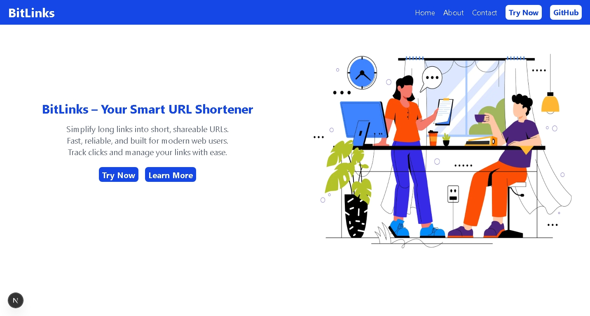
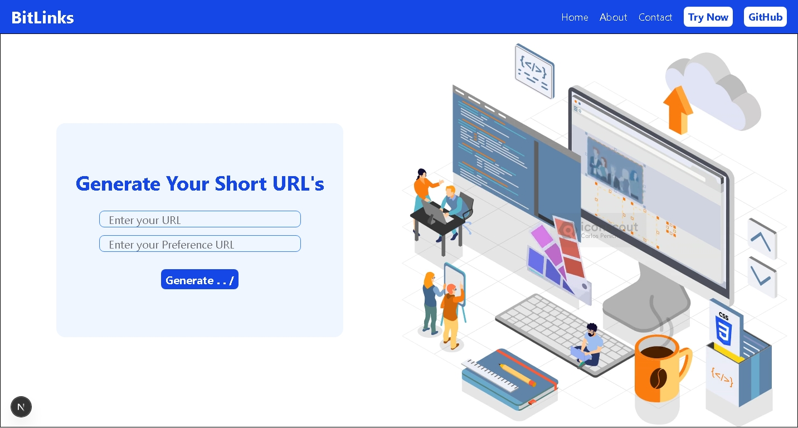
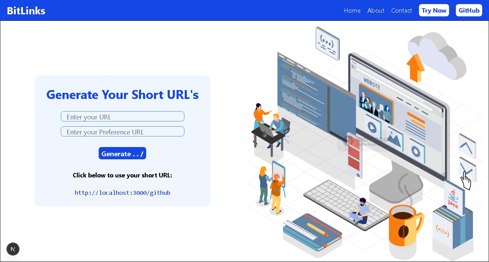

# BitLinks – URL Shortener

A modern URL shortener built using Next.js App Router and MongoDB.  
Users can generate short links and get redirected using dynamic routing.

---

## Features

- Generate short URLs from long links
- Dynamic route redirection
- MongoDB database integration
- Clean Next.js App Router structure
- Fast client–server communication

---

## Tech Stack

- Next.js 
- Node.js
- MongoDB
- JavaScript
- REST API
- Tailwind CSS 

---

A modern URL shortener built using Next.js App Router and MongoDB.  
Users can generate short links and get redirected using dynamic routing.

---

## Project Structure
```bash
bitlinks-url-shortener/
├── app/
│ ├── [shorturl]/
│ │ └── page.js # Dynamic redirect route
│ ├── api/
│ │ └── short/
│ │ └── route.js # API route to create short URLsendpoint
│ ├── short/
│ │ └── page.js # URL creation page
│ └── page.js
├── components/
│ └── Navbar.js
├── lib/
│ └── mongodb.js # Database connection
├── public/
├── README.md
```
---

## Installation & Setup

### 1️. Clone the repository
```bash
git clone https://github.com/Yash-Shekh/bitlinks-url-shortener.git
```
### 2. Navigate into project
```bash
cd bitlinks-url-shortener
```
### 3. Install dependencies
```bash
npm install
```
### 4. Create environment file
```bash
MONGODB_URI=your_database_connection_string
BASE_URL=http://localhost:3000
```
### 5. Run the development server
```bash
npm run dev
```

---

## How It Works (Backend Flow)

1. User submits a long URL

2. Frontend sends POST request to /api/short

3. Backend generates unique short ID

4. MongoDB stores mapping

5. Visiting /shortId triggers redirect

---

## API Endpoint

- Create Short URL
```bash
POST /api/short
```
- body
```bash
{
  "url": "https://example.com"
}
```

---

## Future Improvements

- User authentication

- Analytics dashboard

- QR code generation

- Link expiration feature

---

## 📸 Screenshots

### 🏠 Homepage


### ✂️ Create Short URL


### 🔗 Generated Link


---

# 👨‍💻 Author

### ***Yash Shekh***  
_BCA AI/ML Student_

### GitHub: https://github.com/Yash-Shekh


